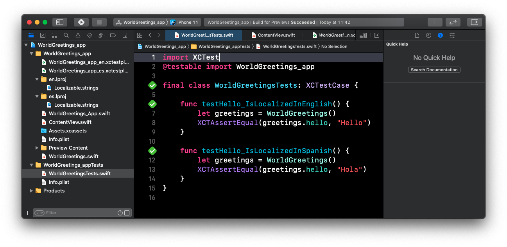

# WorldGreeter App

A simple app that shows how to use `.xctestplan` to selectively run a test out of a `XCTestCase` class with different language configurations. 

## WorldGreetings_app_en.xctestplan

Runs `WorldGreetingsTests` but excludes test `WorldGreetingsTests.testHello_IsLocalizedInSpanish()`

## WorldGreetings_app_es.xctestplan

Runs `WorldGreetingsTests` but excludes test `WorldGreetingsTests.testHello_IsLocalizedInEnglish()`